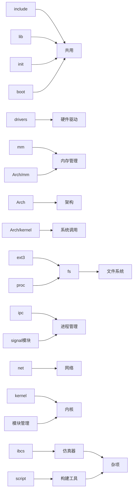

Linux内核而言

角色（模块）：硬件平台架构兼容模块，虚拟文件系统，进程管理，内存管理，驱动管理-网络堆栈，系统调用

7个主要模块

源码目录与模块的关系

？

### 读Linux 1.0 README

WHAT IS LINUX?

介绍了特性，如支持多任务，TCP/IP，虚拟内存，copy-on-write的共享库等

INSTALLING the kernel:

如何安装内核

用tar xvf 解压缩 linxu-1.0.tar

删掉现有 /usr/include下的 linux 和 asm 的头文件

并将新解压的在这个目录下做软连接 ln -s

随后在解压的目录下用 make mrproper 安装

CONFIGURING the kernel:

配置内核，需要在bash环境下用 make config命令

编辑 drivers/net/CONFIG 来配置网络模块

最后用 make dep 来设置依赖是否正确

COMPILING the kernel:

编译内核

用 gcc xxx版本来编译，或者更新的版本

用 make zImage 来创建压缩的内核

如果想制作启动软盘（不用 根文件系统 或者 lilo引导程序），插入软盘并 make zdisk

如果你装了 lilo 那么用 make zlilo 。。。。

为了启动新的内核，复制内核镜像到 /usr/src/linux/zImage

如果想从硬盘启动linux，并且使用lilo的话，它从 /etc/lilo/config 来指定内核的镜像，内核文件一般会是 /vmlinuz /zImage /etc/zImage

更新使用新内核，覆盖老的镜像，并必须返回LILO 更新加载地图？(LODING MAP)，否则不能启动成功

IF SOMETHING GOES WRONG:

其中一条

如果出现异常，有dump信息，通过如 EIP 的 hex value ，可以方便定义为哪个内核方法出现了问题

找到和内核相关的二进制文件

### 读Linux 3.0 README

？

